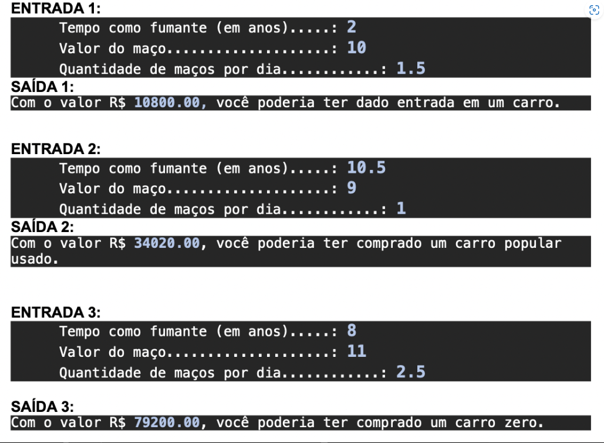

# FIAP-phaseOne_calculoFumo

## Project developed during software engineering course's phase 1 at FIAP.

Program for calculating the amount of money spent on tobacco according to the year, the price of a pack, and the number of packs smoked per day. It receives input values for these parameters, limiting the user to only input positive numerical values.


## To run the code
```python calculo_fumo.py```

## User Case


